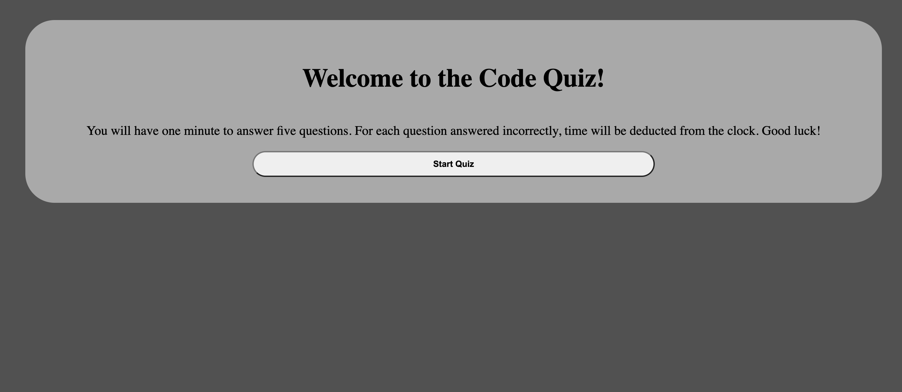
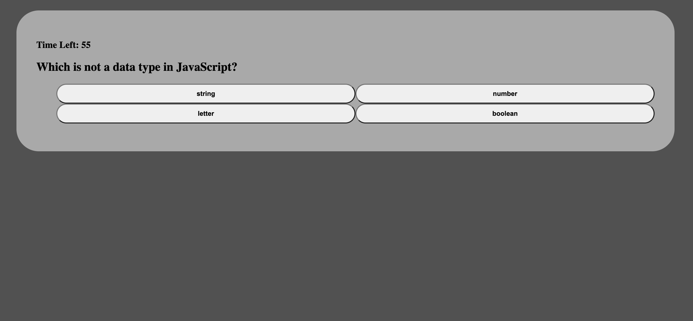
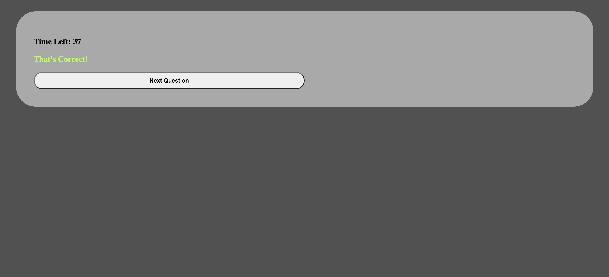
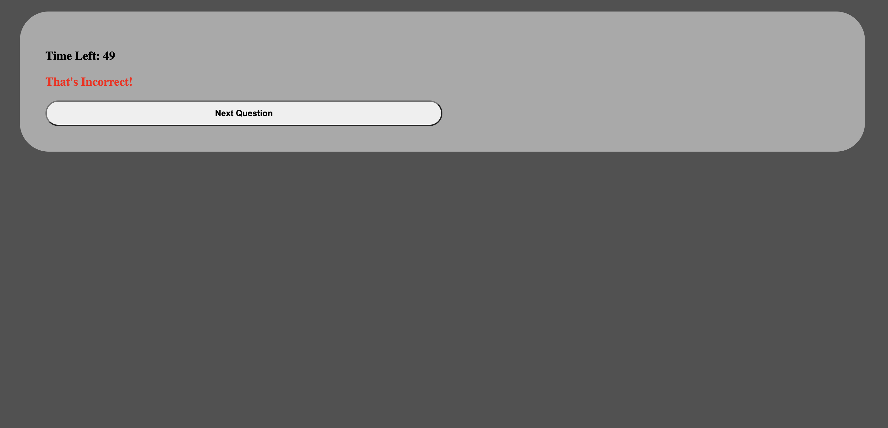

# API-Code-Quiz

## Description

The purpose of the application is to allow users to take a timed coding quiz with multiple-choice questions. You will have 60 seconds to complete the quiz. For each question answered incorrectly, 10 seconds will be deducted from the timer. It runs in the browser, and scores will be saved at the end of the quiz so that the user can track their progress over time.

My deployed application can be found [here](https://conartisttt.github.io/API-Code-Quiz/)

## Features

* Dynamically updated HTML & CSS, powered by JavaScript
* Timer
* Use of localStorage to store final scores

The following animation demonstrates the application functionality:

## Technologies Used

* HTML
* CSS
* JavaScript
* Web API's

## Credits

* All code written by Conner Martin aka Conartisttt